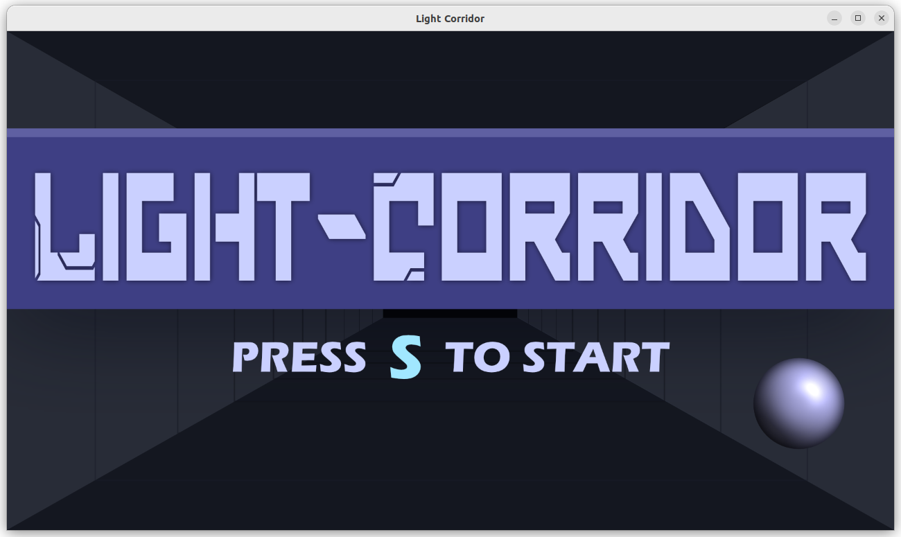
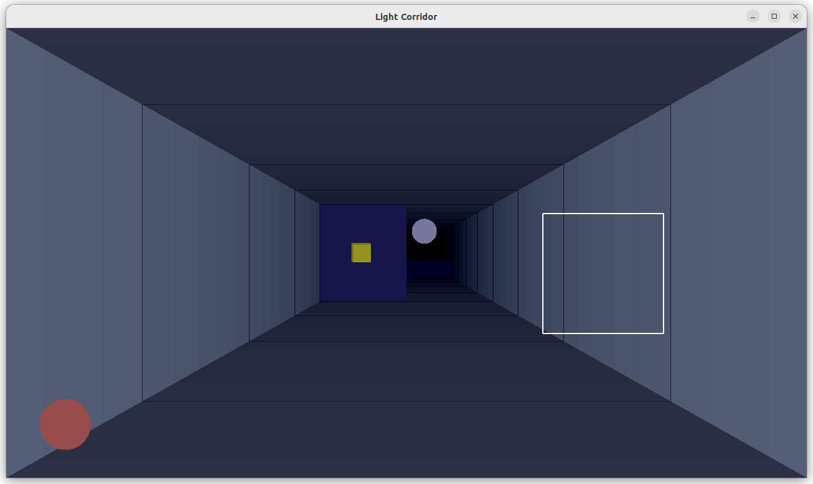

# Light Corridor - Projet Opengl
> Par Eliott D. et Coralie B.

## Présentation

Ce projet est une recréation d'un ancien jeu "The Light Corridor". Le principe est d'avancer dans un couloir avec une balle que l'on doit rattraper, et qui rebondit sur des obstacles. Ce projet en 3D est réalisé en C avec OpenGl.

## Commandes de compilation et d'exécution

```bash
make
```
```bash
./bin/light-corridor
```

Pour faire les deux en même temps :
```bash
make && ./bin/light-corridor
```

## Captures d'écran du jeu

Menu du jeu


Jeu en cours
